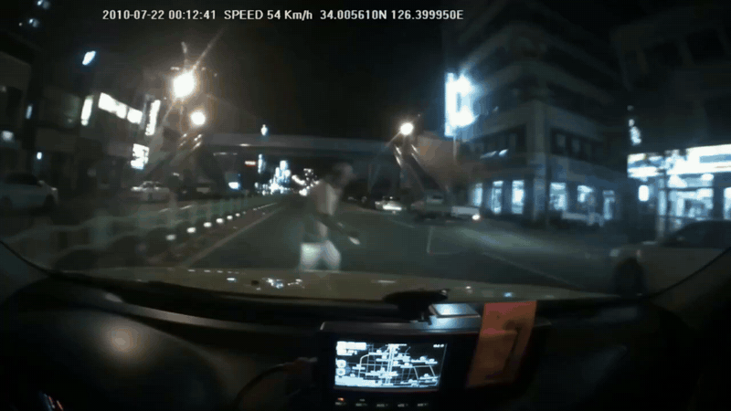
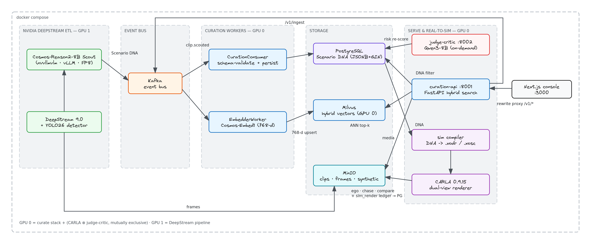

# My-Curator



An **ego vehicle driving video automatic curation platform examples**, with a **real-to-sim demo** on top.

Uses NVIDIA DeepStream 9.0 with NVIDIA Cosmos Reason 2 for automatic curation,
and the CARLA simulator for real-to-sim.

A GPU pipeline segments driving video and annotates every clip
with a schema-validated **Scenario DNA** record; a hybrid vector+JSONB search
API and a React (Next.js) console surface the corpus for search and review.
As a feasibility demonstration, a curated clip can also be **re-staged in
CARLA from its DNA alone** — road-network selection, OpenSCENARIO compilation,
and dual-view rendering, with no access to the original video.

**Live:** [ijlee0812.github.io/My-Curator](https://ijlee0812.github.io/My-Curator)

---

## Architecture



---

## Tech stack

| Component | Version | Role |
|---|---|---|
| DeepStream | 9.0 | GStreamer GPU pipeline |
| Cosmos-Reason2-8B | FP8 | Scout VLM → Scenario DNA v0.2 |
| Cosmos-Embed1-336p | — | Hybrid clip embedding — video + narrative text (768-dim) |
| Qwen3-8B | AWQ | Judge critic — offline risk re-scoring (report-only) |
| vLLM | **0.14.0** (pinned) | VLM inference engine |
| Ultralytics YOLO26 | m / s / l | Closed-vocab detector |
| TensorRT | 10.14 | `nvinfer` backend |
| CUDA | 13.1 | Toolchain |
| CARLA | 0.9.15 | Real-to-sim re-staging + dual-view rendering |
| OpenSCENARIO / OpenDRIVE | 1.0 | Scenario / road description (ASAM) |
| FastAPI | — | curation-api (port 8001) |
| Next.js | 16.2.6 + React 19 | Curation console (port 3000) |
| Kafka | 7.6 | Event bus |
| Milvus (GPU_CAGRA) | 2.6.15 | Vector store (IP metric) |
| PostgreSQL | 17 | DNA store (JSONB + GIN) |
| MinIO | — | Object store (clips · frames · synthetic renders) |

---

## Project layout

```
My-Curator/
├── my_curator/                   # clean-architecture package (pip install -e .)
│   ├── domain/                   # DNA validator · scout/judge logic · sim mapping + .xosc compiler
│   ├── adapters/                 # PG · Milvus · MinIO · Kafka · GStreamer · CARLA executor/recorder
│   ├── application/              # pipeline · curation consumer · embedder worker
│   ├── interfaces/               # FastAPI app + routers (search · ingest · clips · review)
│   └── cli/                      # run_pipeline · run_judge_pass · build_road_index ·
│                                 #   run_sim_map / run_sim_compile / run_sim_render …
├── services/ui/                  # Next.js 16 curation console
├── infra/
│   ├── compose.base.yml          # storage stack — Postgres + Milvus + MinIO + etcd
│   ├── compose.curate.yml        # curate overlay — Kafka + curation-api + embedder + UI
│   ├── compose.pipeline.yml      # NVIDIA DeepStream pipeline container
│   └── compose.simulate.yml      # CARLA 0.9.15 server (on-demand `--profile simulate`)
├── schemas/                      # scenario_dna_v0_2.schema.json · OpenSCENARIO_1.0.xsd
├── prompts/                      # Scout (Cosmos-Reason2) + Judge (Qwen3) prompt cards
├── configs/                      # nvinfer .txt configs + YAML pipeline config
└── tests/                        # unit · integration · e2e (incl. corpus-wide XSD compile check)
```

---

## Quickstart

**Prerequisites:** Docker + NVIDIA Container Toolkit · NGC API key ·
2× RTX 4090+ GPUs. GPU 1 runs the DeepStream pipeline (~20 GiB); GPU 0 runs the
curate stack, plus **either** CARLA **or** the judge critic — the two must not
share GPU 0 at the same time.

```bash
git clone https://github.com/IJLee0812/My-Curator.git
cd My-Curator
cp .env.example .env   # fill in PG_*, MINIO_*, NGC_API_KEY, VIDEO_DATA_ROOT
```

**Start the storage + curate stack:**

```bash
docker compose --env-file .env \
  -f infra/compose.base.yml \
  -f infra/compose.curate.yml up -d
```

- Curation console → `http://localhost:3000`
- curation-api → `http://localhost:8001`

**Run the NVIDIA DeepStream ETL pipeline** (one warm engine per session;
clips are attached and flushed one at a time):

```bash
docker compose --env-file .env -f infra/compose.pipeline.yml run --rm \
  -e CUDA_VISIBLE_DEVICES=1 deepstream \
  python3 -m my_curator.cli.run_pipeline <video.mp4 | session_dir> \
  -c configs/config_driving_scene.yaml [--dry-run]
```

**Bring up CARLA for real-to-sim rendering (on demand):**

```bash
docker compose --env-file .env -f infra/compose.base.yml \
  -f infra/compose.simulate.yml --profile simulate up -d carla-server
```

---

## Real-to-sim reconstruction (Demo)

A feasibility demo built on the curated corpus — the Scenario DNA emitted by
the curation pipeline is enough to rebuild the scene in a simulator:

```
Scenario DNA ──► town/road selection ──► OpenSCENARIO 1.0 ──► CARLA 0.9.15 ──► ego + chase + comparison MP4s
                 (sim_road_index:            (.xosc, XSD-           (kinematic actors,          (720p @ 10 fps)
                  1,329 lanes / 5 towns)      validated)             warm-up-aware triggers)
```

```bash
# map + compile the corpus, then render one curated clip to three videos
python3 -m my_curator.cli.run_sim_map --all
python3 -m my_curator.cli.run_sim_compile --all
python3 -m my_curator.cli.run_sim_render --clip <source_clip_id>
```

Each render produces an ego view, a chase view, and a side-by-side comparison
against the source clip ([example](assets/videos/render.mp4)).

**Honest scope:** environment reconstruction (road class, intersection,
lighting, weather, time of day) is largely accurate; actor and dynamic
reconstruction is approximate — adversaries are re-staged from coarse DNA
fields (state, distance bucket, motion direction), so trajectories match the
source semantically rather than exactly. The result is a workable foundation
for scenario re-staging, not a trajectory-faithful digital twin.

---

## Tests

```bash
# unit + integration — no GPU required (integration needs the compose stack)
.venv/bin/python3 -m pytest tests/unit tests/integration -q
# → 1240 passed, 3 skipped

# e2e — requires the compose stack (GPU smoke tests need the DS / judge containers)
.venv/bin/python3 -m pytest tests/e2e -m e2e -v
```

Lint: `ruff check . && ruff format --check .`

---

## References

- [NVIDIA DeepStream SDK 9.0](https://developer.nvidia.com/deepstream-sdk)
- [deepstream-vllm-plugin](https://github.com/NVIDIA-AI-IOT/deepstream_reference_apps/tree/master/deepstream-vllm-plugin)
- [Cosmos-Reason2-8B-FP8](https://www.jetson-ai-lab.com/models/cosmos-reason2-8b/)
- [DeepStream-Yolo](https://github.com/marcoslucianops/DeepStream-Yolo) / [DeepStream-Yolo-Seg](https://github.com/marcoslucianops/DeepStream-Yolo-Seg)
- [NVIDIA Cosmos Curator](https://github.com/nvidia-cosmos/cosmos-curate)
- [CARLA 0.9.15](https://carla.org/) / [ASAM OpenSCENARIO 1.0](https://www.asam.net/standards/detail/openscenario/)

## License

Apache 2.0
