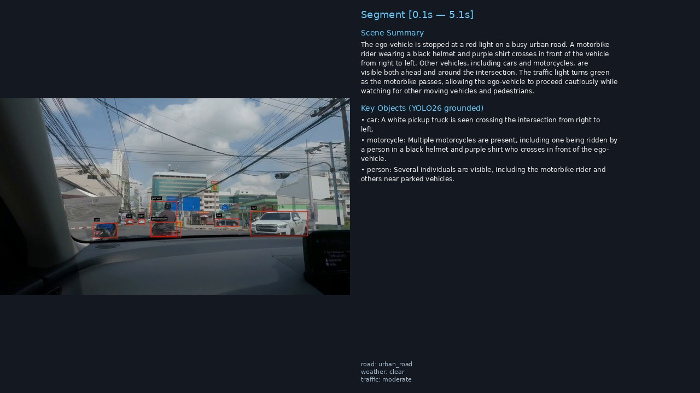
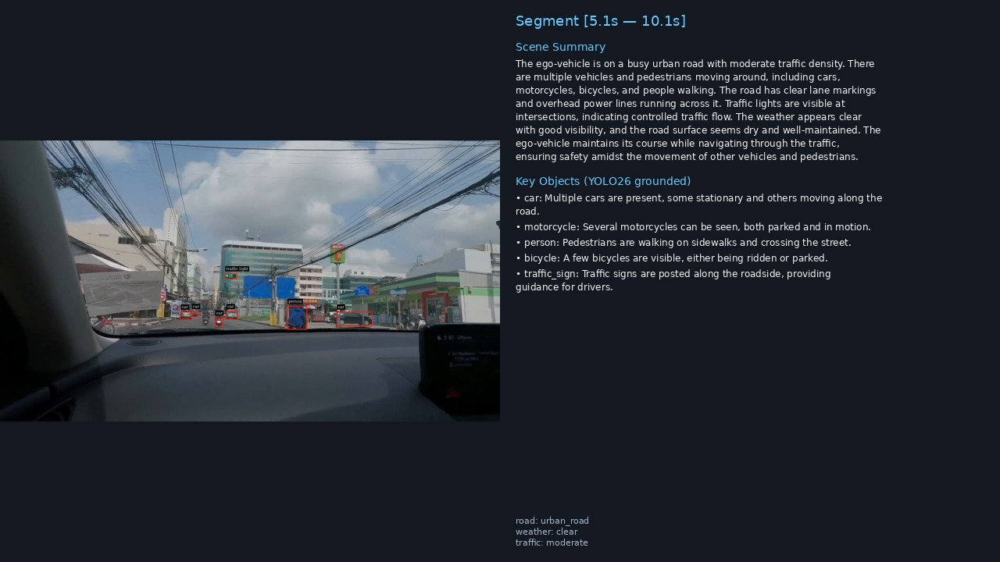
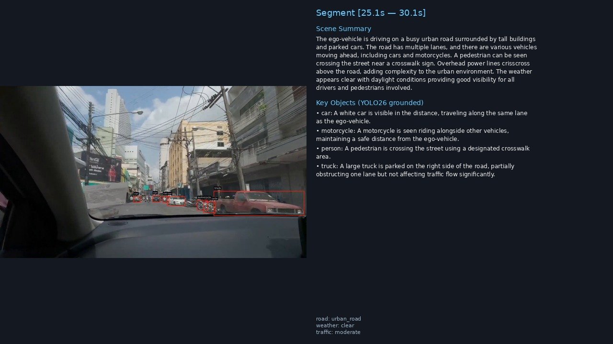

# My-Curator

> An **Autonomous Driving front-camera data curation & validation platform**, built on top of [DeepStream-VLM](https://github.com/IJLee0812/DeepStream-VLM) (NVIDIA DeepStream 9.0 + `nvvllmvlm` + Cosmos-Reason2-8B FP8 + **YOLO26** closed-vocab detector). Upstream YOLOE code paths are inherited but not used in My-Curator.

> **Status**: **P1–P2 complete** — DNA schema, storage tri-stack (MinIO + PostgreSQL + Milvus GPU_CAGRA), Scout N=3, Best-of-N aggregator, Kafka event bus, DNAValidator all operational. **P3-1 complete** — Cosmos-Embed1-336p embedding worker (768-dim vectors). **P3-2 complete** — FastAPI curation-api (hybrid vector+JSONB search, `/v1/clips`, `/v1/search`, `/v1/search/video`). **P3-3 complete** — Recall@5 benchmark harness; gold set (14-clip); Recall@5 = 0.929. **P3-4 complete** — React UI (Next.js 16.2.6 + Tailwind 4.3): Dashboard, Clip Detail with NAS `file://` byte-range streaming, VideoPlayer segment enforcement, Similar-clip panel (video-tower nearest neighbours + DNA fallback), Search page. Review-queue approve/reject HTTP persistence deferred to P3-5.

---

## What it does (today)

A GStreamer pipeline that splits a driving video into temporal windows (e.g. 5-second segments) and, for each segment, produces a **Scenario DNA v0.1** record — a schema-validated 4-layer scene description (ODD / Topology / Actor Dynamics / Planner Logic) emitted by Cosmos-Reason2-8B via chain-of-thought reasoning and enforced by `DNAValidator` against `scenario_dna_v0_1.schema.json`. Valid clips are published to Kafka, consumed by `CurationConsumer`, and stored as JSONB rows in `scenario_dna` (Postgres) with a zero-vector stub in Milvus (P3-1 will replace stubs with real embeddings). Schema-invalid or partial outputs are routed to `review_queue` for human review. Three detector modes are available via `--detect-config`:

| Mode | `nvinfer` config | Vocabulary | Mask |
|---|---|---|---|
| Pure VLM | — | — | — |
| YOLO26 | `config_infer_yolo26.txt` | Closed (80 COCO) | No |
| YOLOE-26 detect | `config_infer_yolo26e.txt` | **Open-vocab** | No |
| YOLOE-26 seg | `config_infer_yolo26e_seg.txt` | **Open-vocab** | **Yes** (OSD) |

Pipeline topology (current):
```
uridecodebin × N → nvstreammux (batch=N) → [nvinfer(YOLO)]
                                         → nvvideoconvert
                                         → nvvllmvlm (Cosmos-Reason2-8B FP8)
                                         → Kafka + JSON (+ optional OSD MP4)
```

Multi-source (RTSP + file) is already supported via `uridecodebin` per stream and a per-`stream_id` `StreamContext` behind a single shared VLM instance.

---

## What it will do (expansion)

The baseline engine covers only the **captioner** step of an AD curation pipeline. My-Curator extends it into a full curation/validation system:

| Direction | Adds |
|---|---|
| **Up** (semantics) | **Scenario DNA v0.1** — queryable 4-layer ontology (ODD / Topology / Actor Dynamics / Planner Logic); schema in `schemas/scenario_dna_v0_1.schema.json` |
| **Sideways** (quality) | Neuro-symbolic **Scout + YOLO26 grounding** — single Cosmos-Reason2 Scout with N=3 temperature sampling + YOLO26 symbolic inventory + best-of-N aggregator (Judge LLM deferred to post-v0.1) |
| **Down** (infra) | MinIO + PostgreSQL (JSONB + GIN) + Milvus (GPU_CAGRA) + Kafka event bus |
| **Forward** (sim) | CARLA 0.9.15 integration + OpenSCENARIO corner-case library + GT-vs-Judge accuracy suite |
| **Around** (ops) | Prometheus + Grafana SLOs, tiered GH Actions CI, gold set indexed in `clips` table (no DVC), k3s/Helm deployment |

---

## Sample output

Left: middle frame of a 5-second segment. Right: VLM scene summary + YOLO-grounded key objects.

<p>
  <br>
  <br>
  
</p>

---

## Quickstart (baseline pipeline)

Prerequisites: Docker w/ NVIDIA Container Toolkit, NVIDIA driver 580+, an RTX 4090-class GPU (≥24 GB VRAM for the Cosmos-Reason2 FP8 checkpoint; target reference is **2× RTX 4090** where GPU 1 will host the expansion infra), NGC API key.

### 1. Clone and bring up the baseline stack
```bash
git clone https://github.com/IJLee0812/My-Curator.git
cd My-Curator
cp .env.example .env          # fill in NGC_API_KEY / HF_TOKEN
docker compose up -d          # my-curator-ds9-vlm-dev + Kafka + Zookeeper
docker exec -it my-curator-ds9-vlm-dev bash
```

### 2. Download the VLM (once, ~9 GB FP8)
```bash
# inside the container
ngc config set                 # paste NGC_API_KEY, org=nvidia
ngc registry model download-version \
    "nim/nvidia/cosmos-reason2-8b:1208-fp8-static-kv8" \
    --dest /workspace/models/hub
```

### 3. Pick a detector and prepare its ONNX
```bash
# Option A — closed-vocab YOLO26 (80 COCO classes)
python3 scripts/download_model.py --model yolo26 --size m
python3 scripts/export_yolo26.py -w models/yolo26m.pt --simplify

# Option B — open-vocab YOLOE-26 detect
python3 scripts/download_model.py --model yoloe --size m
python3 scripts/export_yoloe.py \
    -w models/yoloe-26m-seg.pt \
    --custom-classes "vehicle,person,motorcycle,traffic_sign,traffic_light,truck,bus,bicycle" \
    --dynamic --simplify

# Option C — open-vocab YOLOE-26 seg (masks in OSD)
python3 scripts/export_yoloe_seg.py \
    -w models/yoloe-26m-seg.pt \
    --custom-classes "vehicle,person,motorcycle,traffic_sign,traffic_light,truck,bus,bicycle" \
    --dynamic --simplify --build-engine
```

> **Seg needs `--build-engine`.** On DS 9.0 / TRT 10 / CUDA 13 the `nvinfer` JIT path aborts with `NVRTC_ERROR_COMPILATION` when the ONNX embeds the custom `EfficientNMSX_TRT` / `ROIAlignX_TRT` ops. `trtexec` builds the same engine cleanly; `nvinfer` then only deserializes it.

### 4. Run the pipeline
```bash
# Pure VLM (no grounding)
python3 main.py assets/videos/sample.mp4 \
    -c configs/config_driving_scene.yaml \
    --output results/out.json \
    --kafka-bootstrap localhost:9092 --topic vlm-results

# YOLOE detection → VLM grounded on open-vocab classes
python3 main.py assets/videos/sample.mp4 \
    -c configs/config_driving_scene.yaml --detect \
    --detect-config configs/config_infer_yolo26e.txt \
    --output results/out.json

# YOLOE seg → grounding + annotated MP4
python3 main.py assets/videos/sample.mp4 \
    -c configs/config_driving_scene.yaml --detect \
    --detect-config configs/config_infer_yolo26e_seg.txt \
    --detect-output results/seg_osd.mp4 \
    --output results/out.json
```

Add `--dry-run` to skip Kafka and print results to stdout.

| Flag | Meaning |
|---|---|
| `-c`, `--config` | YAML config (model + prompts + segment window) |
| `--detect` | Enable object-detection branch |
| `--detect-config` | `nvinfer` `.txt` path; default = `configs/config_infer_yolo26.txt` |
| `--detect-output` | Write an OSD MP4 (bbox + instance masks for seg configs) |
| `--output` | Save all segments as a JSON array |
| `--kafka-bootstrap`, `--topic` | Kafka producer target |
| `--dry-run` | Skip Kafka |

---

## Why open-vocab matters

YOLOE bakes arbitrary class-name embeddings into the detector head at export time (`model.set_classes(...)` → `head.fuse(txt_pe)`). Ship a driving-scene model with `{vehicle, pedestrian, traffic_sign}` or a retail-camera model with `{shelf, cart, person}` from the same checkpoint — no retraining, no runtime text-prompt cost. Detection hints the VLM receives match **your** vocabulary instead of COCO-80.

In My-Curator, this becomes the **Scout's symbolic grounding**: YOLOE inventory is aggregated per clip (lateral zone + proximity for VRUs) and injected into the VLM prompt so Cosmos-Reason2 can sanity-check its own captions. Phase 2 of the expansion adds a separate **Judge** that cross-checks the DNA output against the inventory and flags `pedestrian_not_grounded`-style hallucinations.

---

## Project layout (current)

```
My-Curator/
├── main.py                               # entrypoint
├── plugin/
│   ├── gstnvvllmvlm.py                   # GStreamer VLM element (nvvllmvlm)
│   ├── vlm_utils.py                      # pure utils (host-testable)
│   ├── config_loader.py                  # YAML config singleton
│   └── output_schema.py                  # DrivingSceneResult (Pydantic) — legacy; superseded by Scenario DNA
├── src/
│   ├── vllm_ds_app_kafka_publish.py      # pipeline builder + Kafka + OSD branch
│   ├── consumer.py                       # optional Kafka consumer
│   ├── scouts/
│   │   ├── base.py                       # ScoutConfig, ScoutReport dataclasses
│   │   ├── cosmos_reason.py              # CosmosReasonScout — N=3 temperature sampling
│   │   ├── aggregator.py                 # BestOfNAggregator — symbolic reward + YOLO26 inventory overlap
│   │   ├── dna_validator.py              # DNAValidator — 3-stage CoT JSON extraction + jsonschema validation
│   │   └── versioning.py                 # PROMPT_VERSION_MAP — prompt hash → dna_version
│   ├── bus/
│   │   └── kafka.py                      # CurationConsumer — Kafka → Postgres + Milvus bridge
│   ├── storage/
│   │   ├── pg.py                         # PGRepository — asyncpg Postgres DAL
│   │   ├── milvus.py                     # MilvusRepository — Milvus GPU_CAGRA DAL
│   │   └── minio.py                      # MinIORepository — S3-compatible object store DAL
│   └── streaming/
│       ├── base.py                       # serve_segment() — FileResponse + Accept-Ranges for file:// URIs
│       ├── minio.py                      # presigned-URL redirect for minio:// URIs
│       └── timestamp.py                  # get_precise_times() — .timestamp sidecar → precise_start_s/end_s
├── services/
│   ├── curation_api/                     # FastAPI curation-api (port 8001)
│   │   ├── main.py                       # app factory + lifespan (PG + Milvus + MinIO pools)
│   │   ├── clips.py                      # GET /v1/clips, /v1/clips/{id}, /v1/clips/{id}/stream
│   │   ├── search.py                     # POST /v1/search (hybrid), POST /v1/search/video
│   │   ├── stats.py                      # GET /v1/stats — live corpus metrics
│   │   └── Dockerfile
│   └── ui/                               # Next.js 16.2.6 + React 19 + Tailwind 4.3 curation console (port 3000)
│       ├── app/
│       │   ├── page.tsx                  # Dashboard — live stats + recent clips
│       │   ├── search/page.tsx           # Search — hybrid text+filter query
│       │   ├── review/page.tsx           # Review Queue — pending clips (approve/reject P3-5)
│       │   └── clips/[id]/
│       │       ├── page.tsx              # Clip Detail — DNA accordion + video player + similar clips
│       │       ├── VideoPlayer.tsx       # NAS file:// streaming, startS/endS JS enforcement
│       │       ├── SimilarClipsPanel.tsx # video-tower NN + DNA-text fallback
│       │       └── ApproveRejectButtons.tsx
│       ├── components/                   # ClipThumbnail, DNAAccordion, RiskBadge, Sidebar
│       ├── lib/
│       │   ├── api.ts                    # typed fetch wrappers (NEXT_PUBLIC_API_BASE / INTERNAL_API_BASE)
│       │   └── mock-data.ts              # ScenarioDNA types + RECALL_AT_5 constant
│       └── Dockerfile                    # multi-stage: node:20-alpine → next build → standalone
├── schemas/
│   └── scenario_dna_v0_1.schema.json     # Scenario DNA v0.1 JSON Schema (frozen; additionalProperties: false)
├── prompts/
│   └── scout_cosmos_reason2.v1.md        # hash artifact — mirrors config_driving_scene.yaml system_prompt
├── infra/
│   ├── compose.base.yml                  # storage stack: Postgres + Milvus + MinIO + etcd  ← start first
│   ├── compose.curate.yml                # curation overlay: Kafka + curation-api + embedder + UI
│   ├── compose.pipeline.yml              # DS pipeline: my-curator-ds9-vlm-dev
│   ├── cleanup_curator_db.py             # wipe PG + Milvus + MinIO for a fresh run
│   └── init-sql/
│       ├── 001_schema.sql                # base schema (sessions, clips, scenario_dna, review_queue)
│       ├── 002_curation_meta.sql         # P2-6: curation_meta JSONB column
│       ├── 003_frames_blob_uri.sql       # P3-1: frames_blob_uri column on clips
│       └── 004_source_clip_id.sql        # P3-4: source_clip_id column on clips
├── configs/                              # nvinfer .txt + YAML configs
├── scripts/                              # YOLO26 / YOLOE download + ONNX export
├── lib/                                  # DS 9.0 custom YOLO parsers (.so)
├── .github/                              # issue/PR templates + auto-assign + CODEOWNERS
└── tests/
    ├── unit/                             # host-runnable (no GPU/Docker)
    ├── integration/                      # real Postgres via testcontainers + AsyncMock DALs
    └── e2e/                              # DS Docker container + GPU + compose stack
```

---

## Tests

The test suite has **596 tests** across `unit`, `integration`, `schema`, and `e2e` markers.

```bash
# host — unit + integration, no GPU/Docker needed
.venv/bin/pytest tests/unit tests/integration -q

# storage integration tests require the compose stack
docker compose -f infra/compose.base.yml --env-file .env up -d
docker compose -f infra/compose.curate.yml --env-file .env up -d
.venv/bin/pytest tests/integration -m integration -q

# e2e — full stack: storage + curation-api + DS pipeline
docker compose -f infra/compose.pipeline.yml --env-file .env up -d
.venv/bin/pytest tests/e2e/test_curation_api.py -m e2e -v
# DS pipeline e2e (inside DS container)
docker exec my-curator-ds9-vlm-dev \
  bash -c "cd /workspace && python3 -m pytest tests/e2e -v"
```

pytest markers: `unit`, `integration`, `schema`, `e2e`, `performance`, `simulation`, `prompt_regression`, `gpu`, `slow`.

Lint: `ruff check . && ruff format --check .` (config in `pyproject.toml`).

---

## Running the full curation stack (P3+)

> **Important**: `compose.base.yml` must be started first so that `curation-net` exists before the overlay stacks try to join it. The UI build also bakes `NEXT_PUBLIC_API_BASE` into the JS bundle — set it in `.env` before `compose build` if curation-api is not on `localhost`.

### 1. Configure `.env`

```bash
cp .env.example .env
# Required fields:
#   DATA_ROOT        — local SSD path for Postgres/Milvus/MinIO volumes
#   PG_USER / PG_PASSWORD / MINIO_USER / MINIO_PASSWORD
#   VIDEO_DATA_ROOT  — absolute path to the source video dataset (mounted read-only)
#   CURATOR_SESSION_ID — frame key prefix for the current ingest run
```

### 2. Start the storage stack (creates `curation-net`)

```bash
docker compose -f infra/compose.base.yml --env-file .env up -d
```

> **Fresh DB only**: `docker-entrypoint-initdb.d` (i.e. `infra/init-sql/001–004`) runs only when the Postgres data directory is empty. If you have an existing volume and need a clean slate:
> ```bash
> .venv/bin/python3.10 infra/cleanup_curator_db.py   # wipe PG + Milvus + MinIO
> # then recreate the postgres volume and restart compose.base.yml
> ```

### 3. Start the curation overlay (Kafka + curation-api + embedder + UI)

```bash
docker compose -f infra/compose.curate.yml --env-file .env up -d
# UI is available at http://localhost:3000
# curation-api at http://localhost:8001
```

### 4. Start the DS pipeline

```bash
docker compose -f infra/compose.pipeline.yml --env-file .env run --rm \
  -e CUDA_VISIBLE_DEVICES=1 my-curator-ds9-vlm-dev \
  python3 src/vllm_ds_app_kafka_publish.py <sources> [--source-clip-id <id>]
```

---

## Contributing

- Issues / PRs are auto-labeled and auto-assigned — see `.github/`.
- PR title convention: `[P{phase}-{n}] summary` (e.g. `[P2-3] Best-of-N aggregator with YOLO26 symbolic reward`).
- Do not bump `vllm==0.14.0` — the FP8 Cosmos checkpoint produces gibberish on 0.15.1+.

---

## Tech stack

| Component | Version | Role |
|---|---|---|
| DeepStream | 9.0 | GStreamer GPU pipeline |
| Cosmos-Reason2-8B | FP8 | Scout VLM (captioner) |
| Cosmos-Embed1-336p | — | Video embedding (768-dim) |
| vLLM | **0.14.0** (pinned) | VLM inference engine |
| YOLO26 | m/s/l | Closed-vocab detector |
| YOLOE-26 seg | m/s/l | Open-vocab detector + segmentor |
| TensorRT | 10.14 | `nvinfer` backend |
| CUDA | 13.1 | Toolchain |
| FastAPI | — | curation-api (port 8001) — hybrid search, clip CRUD, streaming |
| Next.js | 16.2.6 + React 19 | Curation console UI (port 3000) |
| Kafka | 7.6 | Result publishing |
| Milvus (GPU_CAGRA) | 2.6.15 | Vector search — `clip_video_embed` collection (768-dim, IP metric) |
| PostgreSQL (JSONB+GIN) | 17 | DNA store — `scenario_dna` table with GIN index |
| MinIO | latest | Object store — `raw/`, `clips/`, `frames/`, `artifacts/` buckets |
| *Qwen2.5-14B-AWQ* | — | *Phase 2 — Judge LLM* |
| *CARLA* | 0.9.15 | *Phase 4 — synthetic corner cases* |

Italicized rows are planned additions.

## References

- [NVIDIA DeepStream SDK 9.0](https://developer.nvidia.com/deepstream-sdk)
- [deepstream-vllm-plugin](https://github.com/NVIDIA-AI-IOT/deepstream_reference_apps/tree/master/deepstream-vllm-plugin) — upstream `nvvllmvlm`
- [Cosmos-Reason2-8B-FP8](https://www.jetson-ai-lab.com/models/cosmos-reason2-8b/)
- [DeepStream-Yolo](https://github.com/marcoslucianops/DeepStream-Yolo) / [DeepStream-Yolo-Seg](https://github.com/marcoslucianops/DeepStream-Yolo-Seg)
- [Ultralytics YOLOE](https://docs.ultralytics.com/models/yoloe/)
- [Semantic-Drive](https://github.com/AntonioAlgaida/Semantic-Drive) — 4-layer ontology inspiration
- [NVIDIA Cosmos Curator](https://github.com/nvidia-cosmos/cosmos-curate) — reference AV curation pipeline

## Attribution

This project is a **fork-and-extend** of [DeepStream-VLM](https://github.com/IJLee0812/DeepStream-VLM). The baseline GStreamer pipeline, `nvvllmvlm` integration, YOLO/YOLOE export toolchain, Kafka publisher, and test scaffolding all carry over from the upstream repo; My-Curator layers a curation/validation/search/simulation stack on top.

## License

Apache 2.0
